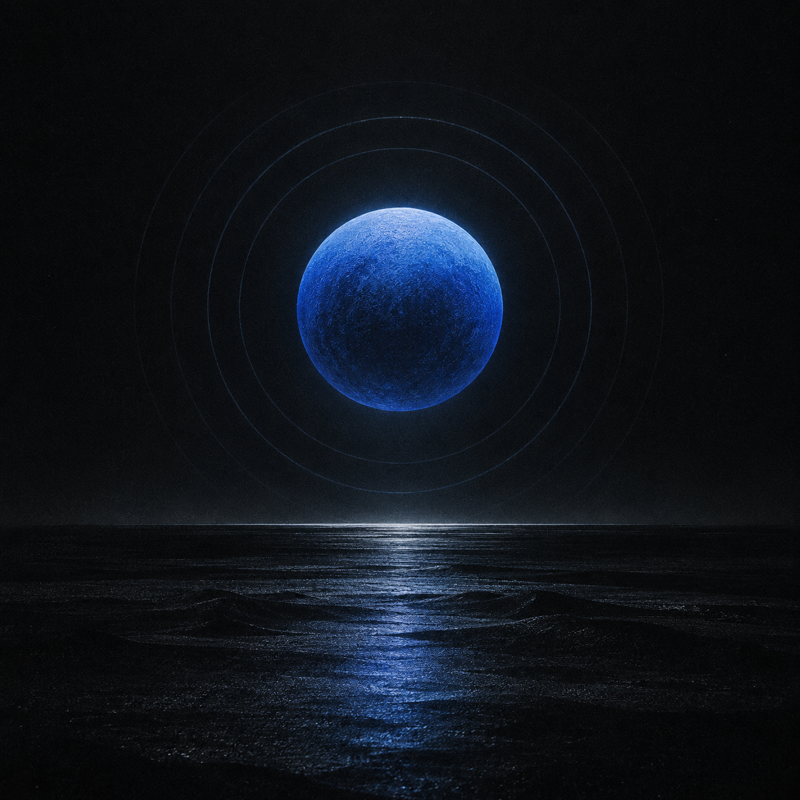

# Kio Radio



A focused, dark internet-radio player for human-curated music, Persian radio, and live global news. Install it on iPhone or any modern PWA-capable browser.

**[Listen on Kio Radio](https://deepinkgroup.github.io/kio-radio/)**

## What it does

Kio Radio brings twenty-two independent live signals into one lightweight player. Tune into alternative, jazz, Persian, French, and world music; settle into classical, ambient, or lo-fi focus streams; or switch directly to Persian and international news audio.

- Real HTTPS audio streams—no demo tracks or simulated playback
- Music, Focus, News, and Favorites filters
- Instant station search
- Previous/next controls, mute, and precise volume control
- Station frequencies and digital channel identifiers across the dial
- Persistent sleep timer with presets from 15 minutes to 2 hours and a custom option
- Shareable station URLs such as `#bbc-world`
- One-click random tuning with the `R` keyboard shortcut
- Favorites, last station, and volume remembered locally
- Installable PWA with a cached offline app shell
- iPhone safe-area support and guided Safari installation
- Lock-screen play, pause, previous, and next controls through the Media Session API
- Clear connecting, buffering, playing, paused, and unavailable states
- Failed playback is marked directly on the dial in red until a later retry succeeds
- Responsive layout with keyboard and reduced-motion support
- No frameworks, analytics, accounts, or runtime dependencies

## The dial

| Station | Category | Frequency / channel | Stream | Broadcaster |
| --- | --- | --- | --- | --- |
| KEXP 90.3 | Eclectic / alternative | 90.3 FM | 160k AAC | [KEXP](https://www.kexp.org/streaming-urls/) |
| NTS 1 | Underground / global | Channel 1 | 256k MP3 | [NTS](https://www.nts.live/radio) |
| NTS 2 | Experimental / global | Channel 2 | 256k MP3 | [NTS](https://www.nts.live/schedule/2) |
| All Classical | Classical | 89.9 FM | 128k MP3 | [All Classical Radio](https://www.allclassical.org/contact/contact-our-technical-team/) |
| WRTI Jazz | Jazz | 90.1 FM | 128k MP3 | [WRTI](https://www.wrti.org/listen-live-to-wrti) |
| Radio Swiss Jazz | Jazz / soul / blues | DAB+ | 128k MP3 | [Radio Swiss Jazz](https://www.radioswissjazz.ch/en/reception/internet) |
| KCRW Eclectic24 | Eclectic / discovery | 89.9 HD2 | 192k MP3 | [KCRW](https://www.kcrw.com/shows/eclectic24/about) |
| FIP | Eclectic / French radio | 105.1 FM | 128k MP3 | [Radio France](https://www.radiofrance.fr/fip) |
| Atma FM Ambient | Ambient / experimental | Channel 1 | 128k MP3 | [Atma FM](https://atma.fm/) |
| SomaFM Groove Salad | Ambient / downtempo | Online | 128k MP3 | [SomaFM](https://somafm.com/groovesalad/) |
| Kalizo Lo-Fi | Lo-fi / chillhop | Online | 192k MP3 | [Kalizo Radio](https://www.kalizoradio.com/radio/lofi/) |
| YourClassical Relax | Calm classical / focus | Online | 128k MP3 | [YourClassical](https://www.yourclassical.org/playlist/relax-stream) |
| BBC World Service | Global news | Digital | 56k MP3 | [BBC Audio](https://www.bbc.com/audio/stations) |
| CNN | Live news | Digital | 96k MP3 | [CNN Audio](https://www.cnn.com/audio) via TuneIn |
| Iran International | Persian news | Digital | Live MP3 | [Iran International](https://www.iranintl.com/radio) |
| Radio Shoma 93.4 | Persian pop / culture | 93.4 FM | Live MP3 | [Radio Shoma](https://www.radioshoma934.ae/en/) |
| Radio Yar | Persian music / talk | Online | Live MP3 | [Radio Yar](https://radioyar.com/) |
| WFMU Freeform | Freeform / community | 91.1 FM | 128k MP3 | [WFMU](https://www.wfmu.org/audiostream.shtml) |
| Radio Paradise | Eclectic | Main Mix | 192k MP3 | [Radio Paradise](https://radioparadise.com/) |
| RP Mellow Mix | Mellow / acoustic | Mellow Mix | 192k MP3 | [Radio Paradise](https://radioparadise.com/) |
| RP Rock Mix | Rock | Rock Mix | 192k MP3 | [Radio Paradise](https://radioparadise.com/) |
| RP Global Mix | Global music | Global Mix | 192k MP3 | [Radio Paradise](https://radioparadise.com/) |

Streams remain hosted and operated by their broadcasters. Availability, programming, advertising, and regional access are controlled by each provider. CNN audio is publicly distributed through TuneIn and may contain inserted advertising.

## Install on iPhone

1. Open [Kio Radio](https://deepinkgroup.github.io/kio-radio/) in Safari.
2. Tap the **Share** button.
3. Choose **Add to Home Screen**, then tap **Add**.

Kio Radio will open in its own full-screen window and expose playback controls on the iPhone lock screen. The interface is cached so it can still open without a connection; live stations always require internet access.

On supported desktop and Android browsers, use the **Install** button in the header or the browser's install command.

## Run locally

Requirements: Node.js 18 or newer.

```bash
git clone https://github.com/DeepInkGroup/kio-radio.git
cd kio-radio
npm start
```

Open [http://127.0.0.1:4173](http://127.0.0.1:4173). Browsers require a user click before audio can begin.

## Controls

| Action | Control |
| --- | --- |
| Play or pause | Main player button or `Space` |
| Previous station | Previous button or `←` |
| Next station | Next button or `→` |
| Random station | Shuffle button or `R` |
| Stop automatically | Sleep timer below the volume control |
| Filter the dial | Category buttons |
| Save a station | Heart button |
| Share a station | Share button |

Keyboard shortcuts are ignored while a form control has focus.

## Development

The project is deliberately small:

```text
index.html                 semantic player markup
style.css                  responsive dark interface
app.js                     station data and playback state
manifest.webmanifest       PWA identity, icons, and shortcuts
sw.js                      same-origin offline app-shell cache
server.js                  dependency-free local server
test/site.test.js          content and security checks
assets/kio-signal.png      original Kio artwork
assets/icon-*.png           iPhone and PWA app icons
```

Run the checks with:

```bash
npm test
```

GitHub Pages serves the static files directly from `main`. The local Node server is only a development convenience.

## Privacy

Kio Radio has no analytics and sends no personal information to its own backend. Playback connects your browser directly to the selected broadcaster. Preferences are stored only in your browser using `localStorage`.

## License

The application code is available under the [MIT License](LICENSE). Radio programming, station names, and third-party streams belong to their respective broadcasters.
